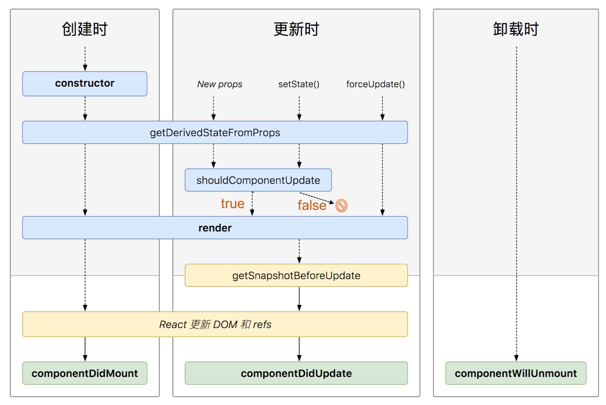

### life cycle map

[Component Life Cycle](http://projects.wojtekmaj.pl/react-lifecycle-methods-diagram/)

### constructor
1. init state 
2. bind method
3. avoid copying props into state
```
constructor(props) {
 super(props);
 // Don't do this!
 this.state = { color: props.color };
} 
```

### static getDerivedStateFromProps
[when to use this mehtod](https://reactjs.org/blog/2018/06/07/you-probably-dont-need-derived-state.html#when-to-use-derived-state)
when props change, update state
```
state = { cachedSomeProp: null };

static getDerivedStateFromProps(nextProps, prevState) {
  // do things with nextProps.someProp and prevState.cachedSomeProp
  return {
    cachedSomeProp: nextProps.someProp,
    ..
  };
}
```
### shouldComponentUpdate
1. not called when component init or forceUpdate() is called
2. return false does not prevent child components rerender
3. not recommend use this method, only exists as a performance optimization.
[performance optimizatio](https://reactjs.org/docs/optimizing-performance.html)

### render
  examine this.props and this.state to return:
  1. React elements
  2. Arrays and fragments
    ```
    render() {
        return (
            <React.Fragment>
            <ChildA />
            <ChildB />
            <ChildC />
            </React.Fragment>
  );
}
    ```
  3. Portals
  ```
  render() {
    // React does *not* create a new div. It renders the children into `domNode`.
    // `domNode` is any valid DOM node, regardless of its location in the DOM.
    return ReactDOM.createPortal(
        this.props.children,
        domNode
    );
}
```
  4. String and numbers
  5. Booleans or null

### getSnapshotBeforeUpdate
```
 getSnapshotBeforeUpdate(prevProps, prevState) {
    if (prevProps.list.length < this.props.list.length) {
      const list = this.listRef.current;
      return list.scrollHeight - list.scrollTop;
    }
    return null;
  }

  componentDidUpdate(prevProps, prevState, snapshot) {
    // (snapshot here is the value returned from getSnapshotBeforeUpdate)
  }
  ```

### componentDidMount
1. set up any subscriptions
2. fetch data
3. do something according to element size    

### componentDidUpdate
```componentDidUpdate(prevProps, prevState, snapshot)```
1. fetch data
2. not use setState

### componentWillUnmount
1. cleaning up subscriptions
2. not use setState, it never be rerender


